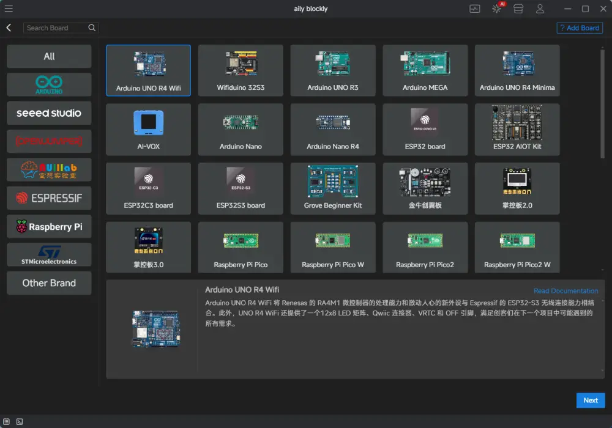

# AilyBlockly

[中文](README_ZH.md) | English

## About This Software
Aily Project is a hardware development integrated environment that plans to integrate numerous AI capabilities to help hardware developers develop more smoothly.  
Aily Blockly is a blockly IDE under the aily Project. In the early stage, it provides AI-assisted programming capabilities for non-professional users. The long-term goal is to break the boundary between professional development and non-professional development, and ultimately achieve natural language programming.  

## Current Version Highlights  
1. **Engineering Project Management**
Uses npm for project management, achieving board and library management on a per-project basis. This solves many engineering deficiencies in traditional embedded development environments. For example, using Arduino IDE may result in board package, library, and current project mismatches, causing compilation failures and runtime errors. In this software, the board versions and library versions in each project are independent and do not affect each other.

2. **Library Manager**
Although we have prepared many libraries (covering almost all commonly used modules), these libraries are actually generated by AI and we have not verified them in detail. We need beta testers to verify and improve them together with us.

3. **Powerful and Compact Serial Debug Tool**
Attempts to create an all-purpose serial tool. Welcome everyone to test, provide feedback, and propose new ideas.

4. **AI Project Generation (Small-scale testing)**
According to user requirements, automatically analyzes projects, recommends development boards, modules, and libraries, generates project architecture diagrams and pin connection diagrams, and creates projects for users.

5. **AI Code Generation (Small-scale testing)**
According to user requirements, automatically writes programs.

6. **AI Library Conversion (Small-scale testing)**
Native C/C++ libraries can be easily converted to libraries used by this software. Based on large model configuration generation, during development, if you want to use an Arduino library but don't have the corresponding blockly library, just provide the Arduino library to AI, and AI will automatically analyze and generate the corresponding blockly library. With this feature, this software can become the blockly platform with the most libraries.

7. **AI Development Board Configuration Generation (Under improvement)**
Based on large model configuration generation, when adding development boards, you no longer need to write new configurations purely by hand. Just provide the development board documentation (md format), and AI will automatically analyze and help you generate development board configuration files. (Only supports development boards with esp32, avr, renesas, rp2040, stm32 as the core, because compilers and core SDKs still need to be prepared by us in advance to the repository)

8. **Lightning Compilation Tool (Coming soon)**
Edge-cloud collaboration, lightning compilation. Reduces the original 1-hour compilation work to 1 minute!

## Unofficial Version Notes  
This alpha version for testing only guarantees the minimum usability, and many planned highlight features have not yet been designed and developed.
The current version is not recommended for actual work use, as many adjustments we make later may cause incompatibility between versions.

## Planned Features
· AI enhancement (project template generation, block/library generation, automatic debugging)    
· Multi-version development board and library coexistence management  
· Hardware simulation  

## Documentation
[User Documentation](https://aily.pro/doc)  
[Library Adaptation Documentation](https://github.com/ailyProject/aily-blockly-libraries/blob/main/%E5%BA%93%E8%A7%84%E8%8C%83.md)  
[Software Development Documentation](./develop.md)  

## Related Repositories
[Development Boards](https://github.com/ailyProject/aily-blockly-boards)  
[Block Libraries](https://github.com/ailyProject/aily-blockly-libraries)  
[Compilers](https://github.com/ailyProject/aily-blockly-compilers)  
[Related Tools](https://github.com/ailyProject/aily-project-tools)  

## Project Sponsorship
This project is sponsored by the following companies and individuals

### Corporate Sponsors
   
 
   
 
   
   
   
  

### Individual Sponsors   
Tao Dong (Tianwei Electronics)  
Xia Qing (Mushroom Cloud Maker Space)  
Du Zhongzhong Dzz (Community Partner)  
Li Duan (Yixuehui)  
Sun Junjie (Community Partner)  

## Main Open Source Projects Used in This Project
[electron]() This project uses electron to build desktop applications  
[angular]() This project uses angular as the rendering end to build main UI logic  
[node]() This project uses npm and node for package management and executing necessary scripts  
[7z]() This project uses 7z to reduce the size of some packages (such as the huge ESP32 compiler)  
Other content can be found in [package.json](./package.json)  

## Additional Rights Statement  
For derivatives or modifications based on this project, without the consent of the project leader (Naihe col), the following activities are prohibited:
1. Information about relevant rights holders and sponsors of this project must not be removed, and such information must appear on the software startup page.
2. The online service content attached to this project must not be removed.